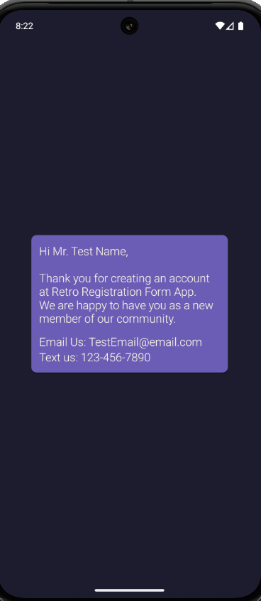

# Registration Form App

An app I created to practice form creation, Material Deisgn 3, and ViewBinding in Kotlin.

## Features

Registration Form:
- First name 
- Last name 
- Email
- Phone number
- Password field

Summary Screen:
- Welcome message with conditional logic
- Clickable email field to send an email via default mail client
- Clickable phone number to send an SMS

UI & Styling
- Retro-inspired SNES color palette
- Custom themes and XML styles using Material 3
- Responsive layout with ScrollView
- Android icons

Data Management
- Parcelable data class for managing intents
- ViewBinding

## Tech Stack
- Language: Kotlin
- UI: Material 3, XML, Vector Assets
- IDE: Android Studio
- MIN SDK: 33

## Screenshots

| Form | Summary Screen                              |
|------|---------------------------------------------|
|  |   |
